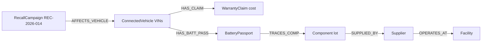

# Demo Questions — OEM Connected Vehicle Lifecycle (NovaDrive Motors)

Five business-grade questions that demonstrate the cross-domain power of the Fabric Ontology — questions no single source system (PLM, MES, ERP, connected-car platform, warranty system, DMS) can answer alone.

---

## Question 1 — Battery Recall Blast Radius (6-hop, the headline scenario)

### Business Question
> "Recall **REC-2026-014** opened against NMC battery cell lot **LOT-2026-NMC-CN-0447**. Which VINs in the field are affected, what is the warranty cost we are already paying for this lot, and which suppliers and plants does it trace back to?"

### Why It Matters
Takata-style recalls cost the industry billions because OEMs cannot quickly answer *who is exposed*. Cutting the precision-targeting time from days to seconds is the single largest ROI moment a Fabric Ontology produces. NHTSA's 2025 totals: 997 recalls covering 29 million vehicles.

### Graph Traversal



### GQL Query

```gql
MATCH (r:RecallCampaign {RecallId: 'REC-2026-014'})-[:AFFECTS_VEHICLE]->(cv:ConnectedVehicle)
      -[:HAS_BATT_PASS]->(bp:BatteryPassport)-[:TRACES_COMP]->(c:Component)
      -[:SUPPLIED_BY]->(s:Supplier)-[:OPERATES_AT]->(f:Facility)
FILTER c.Comp_LotId = 'LOT-2026-NMC-CN-0447'
OPTIONAL_MATCH_REPLACEMENT
MATCH (cv)-[:HAS_CLAIM]->(wc:WarrantyClaim)
LET vin = cv.VIN
LET market = cv.CV_RegMarket
LET supplier = s.Sup_Name
LET plant = f.Fac_Name
RETURN vin, market, supplier, plant, sum(wc.WClaim_CostUSD) AS exposureUSD
GROUP BY vin, market, supplier, plant
ORDER BY exposureUSD DESC
```

> Demo simplification: because Fabric Graph does not support OPTIONAL MATCH, run the warranty join as a separate query and show how the agent stitches the result.

### Expected Results

| VIN | Market | Supplier | Plant | exposureUSD |
|---|---|---|---|---|
| 1NDEQ52026A100001 | USA | VoltCell Energy Systems | VoltCell Wuhan Battery Plant | 2580.00 |
| 1NDEQ52026A100002 | USA | VoltCell Energy Systems | VoltCell Wuhan Battery Plant | 2820.00 |
| 1NDEQ52026A100003 | USA | VoltCell Energy Systems | VoltCell Wuhan Battery Plant | 8400.00 |
| WDB22220262100004 | Germany | VoltCell Energy Systems | VoltCell Wuhan Battery Plant | 180.00 |
| WDB22220262100005 | Germany | VoltCell Energy Systems | VoltCell Wuhan Battery Plant | 580.00 |
| LFV33330262100007 | China | VoltCell Energy Systems | VoltCell Wuhan Battery Plant | 890.00 |
| WDB22220262100014 | France | VoltCell Energy Systems | VoltCell Wuhan Battery Plant | 68.00 |
| 1NDEQ52026A100015 | USA | VoltCell Energy Systems | VoltCell Wuhan Battery Plant | 2400.00 |
| **Total exposure** | | | | **17,918.00** |

### Why Ontology is Better
**Traditional approach:** four systems (recall registry, connected-car platform, battery PLM, warranty system) — three to five data engineers, two days of stitching, dozens of LEFT JOINs. **Ontology:** one graph traversal in seconds. The agent translates the business question directly into a typed graph walk.

---

## Question 2 — OTA Software Vulnerability — Patched vs. Exposed (5-hop)

### Business Question
> "Critical CVE-2026-AUTO-0042 affects ADAS stack versions 3.3.5 and 3.4.1. How many VINs are still running an affected version, which have already been patched to 3.4.2, and which OTA pushes are stuck (Pending or Failed)?"

### Why It Matters
NHTSA can fine $135M for non-compliance. Every day a vehicle runs vulnerable safety software is liability. VW Cariad's 2023 software delays cost €3.4B in write-offs. The faster the OEM can answer "who is exposed", the smaller the liability window.

### Graph Traversal
```
SoftwareRelease (CVE) → DEPLOYS_VERSION ← OTAUpdate
ConnectedVehicle → IS_VARIANT → VehicleVariant → HAS_SW_RELEASE → SoftwareRelease
ConnectedVehicle → RECEIVED_OTA → OTAUpdate (status, retries)
```

### GQL Query
```gql
MATCH (cv:ConnectedVehicle)-[:IS_VARIANT]->(v:VehicleVariant)-[:HAS_SW_RELEASE]->(sw:SoftwareRelease)
FILTER sw.SwRel_Stack = 'ADAS' AND sw.SwRel_CVE = 'CVE-2026-AUTO-0042'
MATCH (cv)-[:RECEIVED_OTA]->(ota:OTAUpdate)-[:DEPLOYS_VERSION]->(patch:SoftwareRelease)
FILTER patch.SwRel_Stack = 'ADAS' AND patch.SwRel_Version = '3.4.2'
LET vin = cv.VIN
LET variant = v.VV_Name
LET market = cv.CV_RegMarket
LET vulnerableVersion = sw.SwRel_Version
LET otaStatus = ota.OTA_Status
LET retries = ota.OTA_RetryCnt
RETURN vin, variant, market, vulnerableVersion, otaStatus, retries
ORDER BY otaStatus, retries DESC
```

### Expected Results

| VIN | Variant | Market | vulnerableVersion | otaStatus | retries |
|---|---|---|---|---|---|
| LFV33330262100008 | NovaDrive Light SUV | China | 3.3.5 | Success | 0 |
| 1NDEQ52026A100015 | NovaDrive EQ5 AMG Line | USA | 3.4.1 | Success | 0 |
| WDB22220262100004 | NovaDrive EQ5 AMG Line | Germany | 3.4.1 | Success | 0 |
| 1NDEQ52026A100001 | NovaDrive EQ5 AMG Line | USA | 3.4.1 | Success | 0 |
| 1NDEQ52026A100002 | NovaDrive EQ5 LX | USA | 3.4.1 | Success | 0 |
| 1NDEQ52026A100003 | NovaDrive EQ5 LX | USA | 3.4.1 | **Failed** | 2 |
| WDB22220262100006 | NovaDrive Light SUV | Germany | 3.3.5 | **Failed** | 3 |

### Why Ontology is Better
The query crosses **product type** (VehicleVariant), **product instance** (ConnectedVehicle), **OTA campaign** (OTAUpdate), and **software release** (SoftwareRelease) — four entities owned by four different organisations (PLM, telematics, OTA campaign, security). A SQL stitch across them takes a sprint. The graph asks the question in business language.

---

## Question 3 — Manufacturing Quality–Telemetry Correlation (2 hops + timeseries)

### Business Question
> "For assemblies that had Critical or Major quality events this week, what were the temperature, torque, and cycle-time readings during build, and do they cluster by facility?"

### Why It Matters
Quality engineers need to know whether a defective batch came from out-of-spec process conditions. World-class OEE quality is 99%+ first-pass; even a 1% defect escape on a 500-unit shift is a real number. Catching the correlation before vehicles ship is worth millions in avoided warranty.

### Graph Traversal
```
QualityEvent (Critical/Major) → AFFECTS_ASM → Assembly [+ Asm_TempC, Asm_TorqueNm, Asm_CycleSec]
                                              → INSTALLED_IN → ConnectedVehicle
ProductionOrder → BUILT_AT → Facility
```

### GQL Query
```gql
MATCH (qe:QualityEvent)-[:AFFECTS_ASM]->(a:Assembly)-[:INSTALLED_IN]->(cv:ConnectedVehicle)
      -[:BUILT_FROM_PO]->(po:ProductionOrder)-[:BUILT_AT]->(f:Facility)
FILTER qe.QE_Severity IN ['Critical','Major']
LET event = qe.EventId
LET severity = qe.QE_Severity
LET assembly = a.AssemblyId
LET assemblyType = a.Asm_Type
LET facility = f.Fac_Name
LET avgTempC = a.Asm_TempC
LET avgTorqueNm = a.Asm_TorqueNm
LET cycleSec = a.Asm_CycleSec
RETURN event, severity, assembly, assemblyType, facility, avgTempC, avgTorqueNm, cycleSec
ORDER BY severity DESC, avgTempC DESC
```

### Expected Results

| event | severity | assembly | assemblyType | facility | avgTempC | avgTorqueNm | cycleSec |
|---|---|---|---|---|---|---|---|
| QE-004 | Critical | ASM-006 | Battery | NovaDrive Stuttgart Assembly | 71.2 | 172.5 | 155.0 |
| QE-001 | Critical | ASM-001 | Battery | NovaDrive Detroit Assembly | 55.2 | 142.1 | 168.0 |
| QE-002 | Critical | ASM-005 | Battery | NovaDrive Stuttgart Assembly | 45.8 | 126.0 | 171.0 |
| QE-008 | Critical | ASM-011 | Drive | NovaDrive Wuhan Assembly | 42.5 | 120.0 | 178.0 |
| QE-007 | Major | ASM-007 | Drive | NovaDrive Stuttgart Assembly | 41.5 | 118.5 | 180.0 |

The cluster is unmissable: **all Critical battery defects coincide with elevated station temperature and torque** at Stuttgart and Detroit. ASM-006 (Stuttgart) and ASM-010 (Wuhan) — both flagged QCFailed — sit ~25°C above the plant average and ~50 Nm above the torque target.

### Why Ontology is Better
Timeseries (Asm_TempC, Asm_TorqueNm, Asm_CycleSec) is **co-located on the entity**. No JOIN to a separate telemetry warehouse, no temporal alignment logic. The agent treats process data and quality data as one model.

---

## Question 4 — IRA Section 30D Compliance — Rule-Aware Mineral Origin Audit

### Business Question
> "Which of our US-registered EVs would FAIL the **IRA Section 30D** mineral-origin test, applying the rule as it is currently written in the ontology (`ComplianceRule.CR-IRA-30D`)? List which dealers in those US markets are EV-certified to handle them."

### Why It Matters
$7,500 IRA EV credit per vehicle. 200,000 US sales × $7,500 = $1.5B in customer incentive value at stake. Non-compliance estimated 15-25% demand reduction. **The FTA country list is volatile** — it shifts every time a new bilateral agreement is signed. Today the demo encodes the list inside `ComplianceRule.CR_NLText` (a natural-language property), so Compliance can edit it without anyone touching GQL.

### Graph Traversal (rule-aware)
```
ComplianceRule (CR-IRA-30D, CR_NLText) → GOVERNS_BATT_PASS → BatteryPassport ← HAS_BATT_PASS ← ConnectedVehicle (US)
ConnectedVehicle → IS_VARIANT → VehicleVariant ← CERTIFIED_FOR ← DealerLocation (US, EV-certified)
```
The agent **first reads the rule text**, extracts the FTA country list and failure conditions in plain English, then evaluates each VIN's BatteryPassport against the rule.

### GQL Query
```gql
MATCH (rule:ComplianceRule {RuleId: 'CR-IRA-30D'})-[:GOVERNS_BATT_PASS]->(bp:BatteryPassport)<-[:HAS_BATT_PASS]-(cv:ConnectedVehicle)
FILTER cv.CV_RegMarket = 'USA'
MATCH (cv)-[:IS_VARIANT]->(v:VehicleVariant)<-[:CERTIFIED_FOR]-(d:DealerLocation)
FILTER d.Dealer_Country = 'USA' AND d.Dealer_EVCert = true
LET vin = cv.VIN
LET variant = v.VV_Name
LET mineral = bp.BPass_Mineral
LET mineralCountry = bp.BPass_OriginCty
LET ruleTitle = rule.CR_Title
LET nearestDealer = d.Dealer_Name
LET dealerCity = d.Dealer_City
RETURN DISTINCT vin, variant, mineral, mineralCountry, ruleTitle, nearestDealer, dealerCity
ORDER BY vin, dealerCity
```

> The query returns *every* US EV that the rule governs. The agent then reads `rule.CR_NLText`, extracts the FTA country list (Australia, Bahrain, Canada, Chile, Colombia, Costa Rica, Dominican Republic, El Salvador, Guatemala, Honduras, Israel, Jordan, South Korea, Mexico, Morocco, Nicaragua, Oman, Panama, Peru, Singapore), and **filters the results in its own reasoning step** to those whose `mineralCountry` is NOT in that list. This is the demo moment: **the regulation lives in the graph, not in the code.**

### Expected Results (after the agent applies the rule)

| VIN | Variant | mineral | mineralCountry | ruleTitle | nearestDealer | dealerCity |
|---|---|---|---|---|---|---|
| 1NDEQ52026A100001 | NovaDrive EQ5 AMG Line | NMC811 | DR Congo | IRA Section 30D Critical Mineral Origin | NovaDrive Detroit Flagship | Detroit |
| 1NDEQ52026A100001 | NovaDrive EQ5 AMG Line | NMC811 | DR Congo | IRA Section 30D Critical Mineral Origin | NovaDrive Boston East | Boston |
| 1NDEQ52026A100002 | NovaDrive EQ5 LX | NMC811 | DR Congo | IRA Section 30D Critical Mineral Origin | NovaDrive Detroit Flagship | Detroit |
| 1NDEQ52026A100003 | NovaDrive EQ5 LX | NMC811 | DR Congo | IRA Section 30D Critical Mineral Origin | NovaDrive Boston East | Boston |
| 1NDEQ52026A100015 | NovaDrive EQ5 AMG Line | NMC811 | DR Congo | IRA Section 30D Critical Mineral Origin | NovaDrive Detroit Flagship | Detroit |

Insight: **5 US EVs (all NMC811 from DR Congo) fail IRA §30D → ineligible for $7,500 credit each → $37,500 in lost incentive value.** Sourcing those packs from KSpark LFP (Australia — on the FTA list per `CR_NLText`) instead would have flipped them to compliant. **If tomorrow the US adds Indonesia to the FTA list, Compliance edits one CSV cell. No code change.**

### Why Ontology + Rules is Better
**Without rule entities** (the old version of this query): `BPass_OriginCty NOT IN ['Australia','Canada','South Korea','Mexico','Chile']` is hard-coded in GQL. Brittle, unauditable, and a developer is on the critical path every time a regulation moves.

**With the `ComplianceRule` entity:** the regulation is data. The agent reads it, the audit log shows which version was applied on which day, and Compliance — not Engineering — owns it. Same answer, different *governance posture*. That posture is what regulated industries are buying.

---

## Question 5 — Complete Vehicle Genealogy (8-hop fan-out)

### Business Question
> "For VIN **1NDEQ52026A100001**, give me the complete genealogy: who owns it, what variant it is, what production order built it at which plant, what assemblies and components went into it (including supplier lots), what drive sessions and OTA updates it has had, and what warranty claims and recalls touch it."

### Why It Matters
A single fact pattern — required for NHTSA recall response, customer inquiries, leasing returns, EOL recycling, and forensic warranty investigation. Today this requires a war room across PLM, MES, CRM, telematics, and warranty. With the ontology it is one query.

### GQL Query (assembled in stages by the agent)

```gql
MATCH (cv:ConnectedVehicle {VIN: '1NDEQ52026A100001'})-[:IS_VARIANT]->(v:VehicleVariant)
MATCH (cv)-[:BUILT_FROM_PO]->(po:ProductionOrder)-[:BUILT_AT]->(f:Facility)
MATCH (cv)<-[:OWNS_VEHICLE]-(o:VehicleOwner)<-[:CUST_OWNS]-(c:CustomerProfile)
MATCH (cv)<-[:INSTALLED_IN]-(a:Assembly)-[:USES_COMPONENT]->(comp:Component)-[:SUPPLIED_BY]->(s:Supplier)
MATCH (cv)-[:HAS_BATT_PASS]->(bp:BatteryPassport)
LET vin = cv.VIN
LET model = cv.CV_Model
LET market = cv.CV_RegMarket
LET variantName = v.VV_Name
LET plant = f.Fac_Name
LET orderNumber = po.PO_Number
LET customer = c.Cust_Name
LET assembly = a.AssemblyId
LET component = comp.Comp_Name
LET componentLot = comp.Comp_LotId
LET supplier = s.Sup_Name
LET battSoH = bp.BPass_SoH
LET battMineral = bp.BPass_Mineral
RETURN vin, model, market, variantName, plant, orderNumber, customer, assembly, component, componentLot, supplier, battSoH, battMineral
```

### Expected Results (collapsed)

| Field | Value |
|---|---|
| VIN | 1NDEQ52026A100001 |
| Model | NovaDrive EQ5 AMG Line |
| Market | USA |
| Variant | NovaDrive EQ5 AMG Line (VAR-EQ5-AMG-25) |
| Plant | NovaDrive Detroit Assembly (FAC-DET-01) |
| Production Order | DET-2026-Q2-001 (PO-2026-DET-001) |
| Customer | Ada Cline (Detroit, USA, NPS 9) |
| Assemblies | ASM-001 (Battery), ASM-003 (Drive), ASM-004 (Chassis) |
| Components | Battery Pack NMC811 (LOT-2026-NMC-CN-0447), Battery Cell NMC (same lot), HV Wiring Harness, Electric Drive Unit EM1, Aluminum Chassis Frame |
| Suppliers | VoltCell Energy Systems (CN), SteelChassis Holdings (MX), InnerveDrive Motors (DE) |
| Battery Passport | SoH 99.8 %, NMC811, mineral origin **DR Congo** |
| Active recalls touching this VIN | REC-2026-014 (NMC thermal runaway), REC-2026-015 (airbag igniter) |
| Active warranty claim | WC-001 ($2,580 HV cable harness, Approved) |

### Why Ontology is Better
Eight or more JOINs across PLM, MES, ERP, CRM, telematics, warranty, recall, and battery-passport systems become a single graph traversal. The agent returns a coherent customer-ready record. **This is the ROI moment a CFO understands.**

---

## Data Agent Instructions

> Support `GROUP BY` in GQL.

You are a NovaDrive Motors business intelligence agent backed by the **OEM Connected Vehicle Lifecycle** Fabric Ontology. The ontology spans 21 entities and 29 relationships, with the **VIN** as the universal join key.

### Hard Rules
- Always use `MATCH`, never `SELECT`. Never use `OPTIONAL MATCH`.
- All aggregations need `GROUP BY` with `LET` aliases for non-aggregated columns.
- Use `ZONED_DATETIME()` for any datetime literals.
- Bounded variable-length quantifiers only (`{1,8}` max).
- Single graph traversals are preferred over multiple `MATCH` clauses; combine when possible.

### Modeling Reminders
- `ConnectedVehicle.VIN` is the spine — most cross-domain questions traverse through it.
- `VehicleVariant` is the type-level spec; do not conflate it with `ConnectedVehicle` (the physical instance).
- Manufacturing entities (`Assembly`, `Component`, `Supplier`, `QualityEvent`, `Facility`, `ProductionOrder`) are the seed pattern from the prior `AutoManufacturing-SupplyChain` demo — they bridge into the new lifecycle entities through `INSTALLED_IN` and `BUILT_FROM_PO`.
- All monetary fields are `double`; never use Decimal.
- All timeseries (CV_*, DS_*, Asm_*, Fac_*, Dealer_*) live on the entity directly — query them like static properties.

### Domain Cheat Sheet
- Recall scope: `RecallCampaign → AFFECTS_VEHICLE → ConnectedVehicle`
- Warranty exposure: `ConnectedVehicle → HAS_CLAIM → WarrantyClaim → COVERED_BY → WarrantyPolicy`
- Software vulnerability: `SoftwareRelease(SwRel_CVE) → DEPLOYS_VERSION ← OTAUpdate ← RECEIVED_OTA ← ConnectedVehicle`
- IRA / battery compliance: `ConnectedVehicle → HAS_BATT_PASS → BatteryPassport(BPass_OriginCty)`
- Vehicle genealogy: `ConnectedVehicle → BUILT_FROM_PO → ProductionOrder → BUILT_AT → Facility` plus `Assembly → INSTALLED_IN → ConnectedVehicle`
- Customer to vehicle: `CustomerProfile → CUST_OWNS → VehicleOwner → OWNS_VEHICLE → ConnectedVehicle`
- Service routing: `ServiceVisit → AT_DEALER → DealerLocation` (with `Dealer_OpenBays`, `Dealer_KitsInStk` timeseries)

### When in doubt
Always pick the question that crosses **two or more business units** — manufacturing + warranty, OTA + dealer, battery + compliance. Single-domain questions can be answered by the source system directly.

### Reasoning over `ComplianceRule` (the rule entity)

The ontology contains a `ComplianceRule` entity whose `CR_NLText` property holds the **full natural-language statement** of each regulation or internal policy. The agent must use it the following way:

1. **Detect rule-shaped questions.** If the user asks about IRA, EU battery, NHTSA, CSRD, warranty eligibility, goodwill, OTA patch SLA, or compliance — those are rule-shaped.
2. **Discover the relevant rule.** Use a `MATCH (r:ComplianceRule) FILTER r.CR_Domain = '<domain>'` query to find the rule(s) that apply.
3. **Read `CR_NLText`.** Treat it as authoritative. It will contain country lists, time windows, percentage thresholds, and severity logic in plain English.
4. **Traverse to governed entities** via the appropriate `GOVERNS_*` edge:
   - `GOVERNS_BATT_PASS` → BatteryPassport (IRA, EU Battery Reg, CSRD)
   - `GOVERNS_POLICY` → WarrantyPolicy (internal warranty + goodwill)
   - `GOVERNS_RECALL` → RecallCampaign (NHTSA timing)
   - `GOVERNS_SW` → SoftwareRelease (OTA security policy / Critical-CVE 30-day SLA)
5. **Apply the rule in your reasoning step.** The rule lives as data; Fabric Graph does not evaluate it for you. Read it, then filter the result set yourself.
6. **Cite the rule in your answer.** Every compliance-shaped answer must include `RuleId`, `CR_Title`, and `CR_Authority` so the human reader knows which rule was applied and as of which `CR_EffectiveDt`.

**Why this matters:** the rule lives in the ontology, not in the GQL. Compliance can edit `CR_NLText` (e.g. add a new FTA country) without anyone touching code. The audit log shows which rule version was in effect at query time. **Regulated industries care more about that posture than about query speed.**
