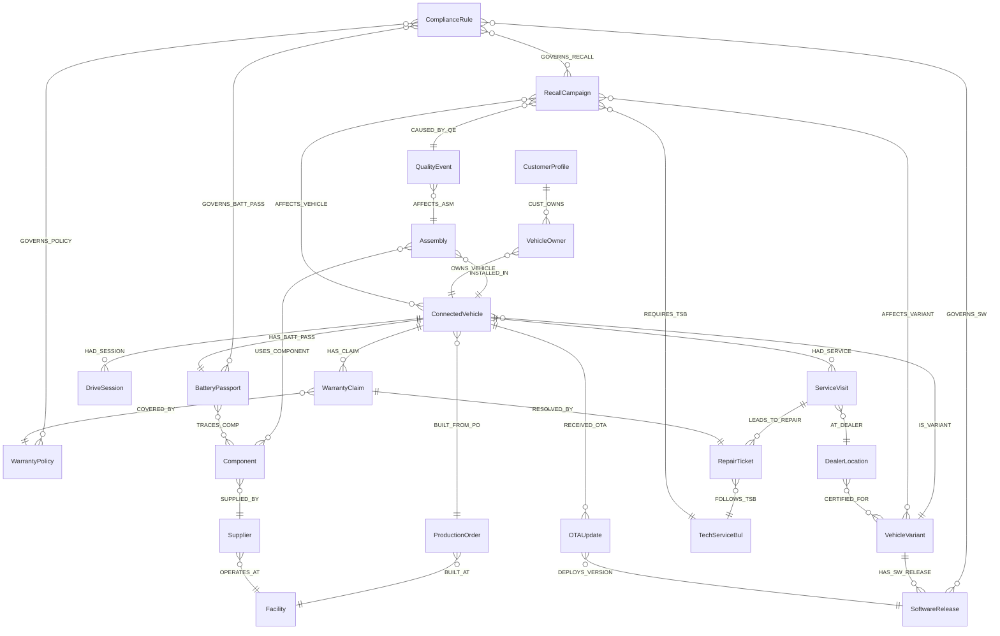

# Ontology Structure — OEM Connected Vehicle Lifecycle

## Overview

This ontology models the full **end-to-end lifecycle of a connected vehicle** at fictional OEM **NovaDrive Motors** — from production order on the assembly line, through battery cell provenance, vehicle build, customer ownership, connected-car telemetry, OTA software, dealer service, warranty claims, recall campaigns, and EU Battery-Regulation passport compliance.

The **VIN (`ConnectedVehicle.VIN`) is the universal identity spine.** Every business unit — Manufacturing, Quality, Service, Software, Sustainability, Finance — joins back to it.

**Scale:** 22 entity types · 33 relationships · 5 timeseries entities · ~660 instances.

The 22nd entity is `ComplianceRule` — natural-language regulatory and internal policies (IRA §30D, EU Battery Reg, NHTSA timing, CSRD, internal warranty, OTA security) that the AI agent **reads and reasons over** when answering compliance-shaped questions. The rule is not machine-evaluated by Fabric Graph; it is data the agent must consult.

---

## Property Planning Table (length-verified)

| Entity Name | Len | Prefix | Sample Properties (with char counts) |
|---|---|---|---|
| ConnectedVehicle | 16 | `CV_` | VIN (3✅), CV_Model (8✅), CV_BuildYr (10✅), CV_Status (9✅), CV_RegMarket (12✅), CV_OdoKm (8✅) |
| VehicleVariant | 14 | `VV_` | VariantId (9✅), VV_Name (7✅), VV_Platform (11✅), VV_Powertrain (13✅), VV_CO2gKm (9✅) |
| SoftwareRelease | 15 | `SwRel_` | SwReleaseId (11✅), SwRel_Version (13✅), SwRel_Stack (11✅), SwRel_Severity (14✅), SwRel_CVE (9✅) |
| CustomerProfile | 15 | `Cust_` | CustomerId (10✅), Cust_Name (9✅), Cust_City (9✅), Cust_Country (12✅), Cust_NPS (8✅) |
| VehicleOwner | 12 | `Owner_` | OwnerId (7✅), Owner_StartDt (13✅), Owner_EndDt (11✅), Owner_Channel (13✅) |
| DriveSession | 12 | `DS_` | SessionId (9✅), DS_StartDt (10✅), DS_DistKm (9✅), DS_DurationMin (14✅), DS_Region (9✅) |
| OTAUpdate | 9 | `OTA_` | OTAUpdateId (11✅), OTA_PushDt (10✅), OTA_Status (10✅), OTA_RetryCnt (12✅) |
| ServiceVisit | 12 | `SVisit_` | VisitId (7✅), SVisit_BookDt (13✅), SVisit_Status (13✅), SVisit_Reason (13✅) |
| RepairTicket | 12 | `Repair_` | TicketId (8✅), Repair_LaborHr (14✅), Repair_PartsUSD (15✅), Repair_State (12✅) |
| TechServiceBul | 14 | `TSB_` | TSBId (5✅), TSB_Title (9✅), TSB_IssueDt (11✅), TSB_LaborCode (13✅) |
| WarrantyClaim | 13 | `WClaim_` | ClaimId (7✅), WClaim_FilingDt (15✅), WClaim_CostUSD (14✅), WClaim_State (12✅), WClaim_DTC (10✅) |
| WarrantyPolicy | 14 | `WPol_` | PolicyId (8✅), WPol_DurMon (10✅), WPol_KmLimit (12✅), WPol_Coverage (13✅) |
| RecallCampaign | 14 | `Recall_` | RecallId (8✅), Recall_Title (12✅), Recall_NHTSAId (15✅), Recall_OpenDt (13✅), Recall_State (12✅) |
| BatteryPassport | 15 | `BPass_` | BattPassId (10✅), BPass_SoH (8✅), BPass_kgCO2e (12✅), BPass_Mineral (13✅), BPass_OriginCty (15✅) |
| Component | 9 | `Comp_` | ComponentId (11✅), Comp_Name (9✅), Comp_PartNum (12✅), Comp_LotId (10✅), Comp_Category (13✅) |
| QualityEvent | 12 | `QE_` | EventId (7✅), QE_Severity (11✅), QE_Description (14✅), QE_DetectDt (11✅), QE_Resolution (13✅) |
| Supplier | 8 | `Sup_` | SupplierId (10✅), Sup_Name (8✅), Sup_Country (11✅), Sup_Tier (8✅), Sup_Rating (10✅) |
| Assembly | 8 | `Asm_` | AssemblyId (10✅), Asm_Type (8✅), Asm_StationId (13✅), Asm_State (9✅), Asm_StartDt (11✅) |
| Facility | 8 | `Fac_` | FacilityId (10✅), Fac_Name (8✅), Fac_City (8✅), Fac_Country (11✅), Fac_TypeKind (12✅) |
| ProductionOrder | 15 | `PO_` | ProdOrderId (11✅), PO_Number (9✅), PO_Quantity (11✅), PO_Priority (11✅), PO_DueDt (8✅) |
| DealerLocation | 14 | `Dealer_` | DealerId (8✅), Dealer_Name (11✅), Dealer_City (11✅), Dealer_Country (14✅), Dealer_EVCert (14✅) |
| ComplianceRule | 14 | `CR_` | RuleId (6✅), CR_Domain (9✅), CR_Title (8✅), CR_NLText (9✅), CR_Authority (12✅), CR_EffectiveDt (14✅), CR_Severity (11✅) |

**All property names ≤ 26 chars · all globally unique · no reserved-word collisions.**

---

## Entity Definitions

| Entity | Key | Key Type | Description | Binding Source |
|---|---|---|---|---|
| **ConnectedVehicle** | VIN | string | The physical VIN-level instance — central spine entity | Lakehouse: DimConnectedVehicle, Eventhouse: ConnectedVehicleTelemetry |
| **VehicleVariant** | VariantId | string | Type-level specification (model/trim/year) | Lakehouse: DimVehicleVariant |
| **SoftwareRelease** | SwReleaseId | string | OTA-deployable software version with CVE/severity tags | Lakehouse: DimSoftwareRelease |
| **CustomerProfile** | CustomerId | string | Synthetic vehicle owner/contact (no real PII) | Lakehouse: DimCustomerProfile |
| **VehicleOwner** | OwnerId | string | Point-in-time ownership record (sale → resale → end-of-life) | Lakehouse: DimVehicleOwner |
| **DriveSession** | SessionId | string | Trip-level rollup of telemetry signals | Lakehouse: DimDriveSession, Eventhouse: DriveSessionTelemetry |
| **OTAUpdate** | OTAUpdateId | string | Over-the-air software deployment record per VIN | Lakehouse: DimOTAUpdate |
| **ServiceVisit** | VisitId | string | Customer-initiated dealer service appointment | Lakehouse: DimServiceVisit |
| **RepairTicket** | TicketId | string | Workshop work order (labor + parts) | Lakehouse: DimRepairTicket |
| **TechServiceBul** | TSBId | string | OEM-issued repair procedure for a known fault pattern | Lakehouse: DimTechServiceBul |
| **WarrantyClaim** | ClaimId | string | Dealer-submitted warranty cost claim | Lakehouse: DimWarrantyClaim |
| **WarrantyPolicy** | PolicyId | string | Coverage terms (duration, km, exclusions) | Lakehouse: DimWarrantyPolicy |
| **RecallCampaign** | RecallId | string | NHTSA/OEM safety recall scope | Lakehouse: DimRecallCampaign |
| **BatteryPassport** | BattPassId | string | EU Battery Regulation 2023/1542 compliance artifact | Lakehouse: DimBatteryPassport |
| **Component** | ComponentId | string | Part / sub-assembly with supplier lot traceability | Lakehouse: DimComponent |
| **QualityEvent** | EventId | string | Production quality defect / inspection finding | Lakehouse: DimQualityEvent |
| **Supplier** | SupplierId | string | Tier 1/2 supplier of components or cells | Lakehouse: DimSupplier |
| **Assembly** | AssemblyId | string | Major build station event (engine/battery/chassis) | Lakehouse: DimAssembly, Eventhouse: AssemblyTelemetry |
| **Facility** | FacilityId | string | Plant, mining site, warehouse, distribution center | Lakehouse: DimFacility, Eventhouse: FacilityTelemetry |
| **ProductionOrder** | ProdOrderId | string | Build batch / production order record | Lakehouse: DimProductionOrder |
| **DealerLocation** | DealerId | string | Authorized dealer/service center (geo + capacity) | Lakehouse: DimDealerLocation, Eventhouse: DealerCapacityTelemetry |
| **ComplianceRule** | RuleId | string | Natural-language regulatory or internal policy the agent must reason over | Lakehouse: DimComplianceRule |

---

## Entity Properties (selected highlights)

### ConnectedVehicle (central spine)

| Property | Type | Description |
|---|---|---|
| VIN | string | ISO 3779 17-char VIN (unique key) |
| CV_Model | string | Model line (e.g., NovaDrive EQ5) |
| CV_BuildYr | int | Model year |
| CV_Status | string | Active / In-Service / End-of-Life |
| CV_RegMarket | string | Country of registration |
| CV_OdoKm | int | Last reported odometer (static snapshot) |
| CV_SoCPct | double | *(timeseries)* State-of-charge % |
| CV_BattTempC | double | *(timeseries)* Battery pack temp |
| CV_DTCCount | int | *(timeseries)* Active DTC count |
| CV_SpeedKmh | double | *(timeseries)* Last speed reading |
| CV_RangeKm | double | *(timeseries)* Estimated range |
| CV_OnlineFlag | int | *(timeseries)* 1 = online in last hour |

### VehicleVariant
VariantId, VV_Name, VV_Platform, VV_Powertrain, VV_CO2gKm, VV_Segment, VV_LaunchYr.

### SoftwareRelease
SwReleaseId, SwRel_Version, SwRel_Stack (ADAS/IVI/BMS/Gateway), SwRel_Severity (Critical/High/Medium/Low), SwRel_CVE, SwRel_PublishDt.

### CustomerProfile
CustomerId, Cust_Name (synthetic), Cust_City, Cust_Country, Cust_NPS, Cust_Segment (Retail/Fleet/Lease).

### VehicleOwner
OwnerId, Owner_StartDt, Owner_EndDt, Owner_Channel (NewSale/CPO/Lease/FleetReturn).

### DriveSession
SessionId, DS_StartDt, DS_DistKm, DS_DurationMin, DS_Region. *(timeseries: DS_AvgSpdKmh, DS_HrshBrkCnt, DS_MaxBattTempC, DS_EnergyKWh)*

### OTAUpdate
OTAUpdateId, OTA_PushDt, OTA_Status (Success/Failed/Pending/Skipped), OTA_RetryCnt.

### ServiceVisit
VisitId, SVisit_BookDt, SVisit_Status (Booked/Done/NoShow), SVisit_Reason.

### RepairTicket
TicketId, Repair_LaborHr, Repair_PartsUSD, Repair_State (Open/Done/Voided).

### TechServiceBul
TSBId, TSB_Title, TSB_IssueDt, TSB_LaborCode.

### WarrantyClaim
ClaimId, WClaim_FilingDt, WClaim_CostUSD, WClaim_State (Submitted/Approved/Denied/Paid), WClaim_DTC.

### WarrantyPolicy
PolicyId, WPol_DurMon (months), WPol_KmLimit, WPol_Coverage (Bumper2Bumper/EVPack/Powertrain/HighVolt).

### RecallCampaign
RecallId, Recall_Title, Recall_NHTSAId, Recall_OpenDt, Recall_State (Open/Closed), Recall_Region.

### BatteryPassport
BattPassId, BPass_SoH (state of health %), BPass_kgCO2e (lifecycle CO2 per pack), BPass_Mineral (LiNiCoMn / LFP / NMC811), BPass_OriginCty (mineral country of origin).

### Component
ComponentId, Comp_Name, Comp_PartNum, Comp_LotId (supplier lot for traceability), Comp_Category, Comp_UnitCost.

### QualityEvent
EventId, QE_Severity (Critical/Major/Minor), QE_Description, QE_DetectDt, QE_Resolution.

### Supplier
SupplierId, Sup_Name, Sup_Country, Sup_Tier (1 or 2), Sup_Rating, Sup_Certified.

### Assembly
AssemblyId, Asm_Type (Battery/Drive/Chassis/IVI), Asm_StationId, Asm_State, Asm_StartDt. *(timeseries: Asm_TempC, Asm_TorqueNm, Asm_CycleSec)*

### Facility
FacilityId, Fac_Name, Fac_City, Fac_Country, Fac_TypeKind (Plant/Mine/Warehouse/Dealer). *(timeseries: Fac_EnergyKWh, Fac_HumidPct, Fac_ProdRateHr)*

### ProductionOrder
ProdOrderId, PO_Number, PO_Quantity, PO_Priority, PO_DueDt.

### DealerLocation
DealerId, Dealer_Name, Dealer_City, Dealer_Country, Dealer_EVCert (boolean — EV/HV-certified). *(timeseries: Dealer_OpenBays, Dealer_KitsInStk)*

### ComplianceRule

| Property | Type | Description |
|---|---|---|
| RuleId | string | e.g. `CR-IRA-30D`, `CR-EU-BATT`, `CR-NHTSA-T1` |
| CR_Domain | string | IRA / EU-Battery / NHTSA / CSRD / Internal-Warranty / OTA-Security |
| CR_Title | string | Short title ("IRA Section 30D Critical Mineral Origin") |
| **CR_NLText** | string | **The full natural-language statement of the rule.** Agents read this and apply it. Includes thresholds, country lists, time windows, severity logic — all in plain English so it stays auditable and editable by Compliance, not data engineering. |
| CR_Authority | string | US-IRS / EU-Commission / NHTSA / NovaDrive-Internal |
| CR_EffectiveDt | datetime | When the rule takes effect |
| CR_Severity | string | Mandatory / Recommended / Internal-Goodwill |

Seed data: 8 rules covering IRA §30D mineral compliance, EU Battery Regulation 2023/1542, NHTSA 5-day notification, NHTSA 18-month 85% completion, CSRD Scope 3 Cat 11, internal EV-pack warranty (8yr/160k), goodwill boundary policy, and Critical CVE 30-day patch SLA.

---

## Relationships (33 — all bound via Edge tables)

| Relationship | Source → Target | Cardinality | Edge Table |
|---|---|---|---|
| IS_VARIANT | ConnectedVehicle → VehicleVariant | M:1 | EdgeCV_Variant |
| HAS_SW_RELEASE | VehicleVariant → SoftwareRelease | 1:M | EdgeVariant_SwRelease |
| BUILT_FROM_PO | ConnectedVehicle → ProductionOrder | M:1 | EdgeCV_PO |
| HAS_BATT_PASS | ConnectedVehicle → BatteryPassport | 1:1 | EdgeCV_BattPass |
| HAD_SESSION | ConnectedVehicle → DriveSession | 1:M | EdgeCV_Session |
| RECEIVED_OTA | ConnectedVehicle → OTAUpdate | 1:M | EdgeCV_OTA |
| HAS_CLAIM | ConnectedVehicle → WarrantyClaim | 1:M | EdgeCV_Claim |
| HAD_SERVICE | ConnectedVehicle → ServiceVisit | 1:M | EdgeCV_Service |
| BUILT_AT | ProductionOrder → Facility | M:1 | EdgePO_Facility |
| INSTALLED_IN | Assembly → ConnectedVehicle | M:1 | EdgeAsm_CV |
| USES_COMPONENT | Assembly → Component | M:M | EdgeAsm_Comp |
| AFFECTS_ASM | QualityEvent → Assembly | M:1 | EdgeQE_Asm |
| DEPLOYS_VERSION | OTAUpdate → SoftwareRelease | M:1 | EdgeOTA_SwRelease |
| CUST_OWNS | CustomerProfile → VehicleOwner | 1:M | EdgeCustomer_Owner |
| OWNS_VEHICLE | VehicleOwner → ConnectedVehicle | M:1 | EdgeOwner_CV |
| AT_DEALER | ServiceVisit → DealerLocation | M:1 | EdgeService_Dealer |
| LEADS_TO_REPAIR | ServiceVisit → RepairTicket | 1:M | EdgeService_Repair |
| FOLLOWS_TSB | RepairTicket → TechServiceBul | M:1 | EdgeRepair_TSB |
| COVERED_BY | WarrantyClaim → WarrantyPolicy | M:1 | EdgeClaim_Policy |
| RESOLVED_BY | WarrantyClaim → RepairTicket | 1:1 | EdgeClaim_Repair |
| CAUSED_BY_QE | RecallCampaign → QualityEvent | M:1 | EdgeRecall_QE |
| AFFECTS_VARIANT | RecallCampaign → VehicleVariant | M:M | EdgeRecall_Variant |
| AFFECTS_VEHICLE | RecallCampaign → ConnectedVehicle | M:M | EdgeRecall_CV |
| REQUIRES_TSB | RecallCampaign → TechServiceBul | M:1 | EdgeRecall_TSB |
| ISSUED_FOR | BatteryPassport → ConnectedVehicle | 1:1 | EdgeBPass_CV |
| TRACES_COMP | BatteryPassport → Component | M:M | EdgeBPass_Comp |
| SUPPLIED_BY | Component → Supplier | M:1 | EdgeComp_Supplier |
| OPERATES_AT | Supplier → Facility | M:1 | EdgeSupplier_Facility |
| CERTIFIED_FOR | DealerLocation → VehicleVariant | M:M | EdgeDealer_Variant |
| GOVERNS_BATT_PASS | ComplianceRule → BatteryPassport | M:M | EdgeRule_BattPass |
| GOVERNS_POLICY | ComplianceRule → WarrantyPolicy | M:M | EdgeRule_Policy |
| GOVERNS_RECALL | ComplianceRule → RecallCampaign | M:M | EdgeRule_Recall |
| GOVERNS_SW | ComplianceRule → SoftwareRelease | M:M | EdgeRule_SwRelease |

---

## Multi-Hop Traversal Highlights

### A. Quality / Warranty Blast Radius (6 hops)
```
QualityEvent → AFFECTS_ASM → Assembly → USES_COMPONENT → Component
            → SUPPLIED_BY → Supplier
Component   ← TRACES_COMP ← BatteryPassport → ISSUED_FOR → ConnectedVehicle
            → HAS_CLAIM → WarrantyClaim
```
**Business value:** "A Critical defect was raised on a battery cell lot. Which VINs in the field carry it, what is the warranty exposure, and which dealers should we route them to?" — 6 hops across **Manufacturing, Quality, Supply Chain, Customer, and Warranty** in one query.

### B. OTA Software Vulnerability (4 hops)
```
SoftwareRelease (CVE) → DEPLOYS_VERSION ← OTAUpdate → RECEIVED_OTA ← ConnectedVehicle
                    → HAD_SERVICE → ServiceVisit → AT_DEALER → DealerLocation
```
**Business value:** "ADAS stack 3.4.1 has CVE-2026-AUTO-0042. Which VINs are unpatched, which are unreachable by OTA (offline), and where are the nearest certified dealers?"

### C. Recall Routing (5 hops)
```
RecallCampaign → AFFECTS_VEHICLE → ConnectedVehicle ← OWNS_VEHICLE ← VehicleOwner
              ← CUST_OWNS ← CustomerProfile
ConnectedVehicle → HAD_SERVICE → ServiceVisit → AT_DEALER → DealerLocation (capacity)
```

### D. IRA / EU Battery Compliance — rule-aware (4-hop with rule traversal)
```
ComplianceRule (CR-IRA-30D, CR_NLText) → GOVERNS_BATT_PASS → BatteryPassport ← HAS_BATT_PASS ← ConnectedVehicle
BatteryPassport → TRACES_COMP → Component → SUPPLIED_BY → Supplier → OPERATES_AT → Facility (mining country)
```
The agent **first traverses to the rule**, reads `CR_NLText` (which includes the FTA country list and the failure conditions in plain English), then evaluates each VIN's BatteryPassport against the rule. The country list lives in the rule, not in GQL — Compliance can edit it without touching code.

### E. Manufacturing Quality–Telemetry Correlation (2 hops + timeseries)
```
QualityEvent (Critical) → AFFECTS_ASM → Assembly  [+ Asm_TempC, Asm_TorqueNm, Asm_CycleSec]
                                       → INSTALLED_IN → ConnectedVehicle
```

### F. Vehicle Genealogy (8-hop fan-out)
```
ProductionOrder → BUILT_AT → Facility
ProductionOrder ← BUILT_FROM_PO ← ConnectedVehicle
                                ← INSTALLED_IN ← Assembly → USES_COMPONENT → Component → SUPPLIED_BY → Supplier
                                ← AFFECTS_VEHICLE ← RecallCampaign
                                → HAS_BATT_PASS → BatteryPassport
                                → HAS_CLAIM → WarrantyClaim → COVERED_BY → WarrantyPolicy
```

---

## Entity Relationship Diagram



---

## Business-Unit Value Lenses

| Business Unit | Entities They Care About | Hero Question |
|---|---|---|
| **Manufacturing Ops** | Facility, Assembly, ProductionOrder, QualityEvent + telemetry | "Which assembly stations have temperature/torque/cycle-time patterns that correlate with Critical defects this week?" |
| **Quality Engineering** | QualityEvent, Component, Supplier, RecallCampaign | "Which warranty claims trace back to the same supplier lot or production window?" |
| **Service & Warranty** | ConnectedVehicle, WarrantyClaim, RepairTicket, DealerLocation | "Which vehicles should we proactively service before warranty cost escalates?" |
| **Connected & SDV** | ConnectedVehicle, SoftwareRelease, OTAUpdate | "Which VINs run vulnerable software and cannot be reached by OTA?" |
| **Sustainability / Compliance** | BatteryPassport, Component, Supplier, Facility | "Which packs would fail an IRA Section 30D mineral-origin audit?" |
| **Finance / Recall** | WarrantyClaim, WarrantyPolicy, RecallCampaign | "What is the live warranty + recall reserve exposure by platform?" |
| **Compliance / Policy** | ComplianceRule + governed entities | "What rules currently govern our EU-registered EVs, and which vehicles violate one or more of them?" |

---

*End of ontology-structure.md*
